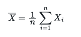

# How the sample mean changes with sample size

In this exercise, we want to look at how the value of the sample mean changes as we change the number of random variables that it is calculated from.  Once you have finished it the code in `main.py` will draw a graph showing how the sample mean computed from a number of uniform random variables changes as you increase the number of random variables from which the mean is computed.  To complete the code you will need to:
 
1. Set the first element of the list called `indices` equal to 1, the second element of the list called `indices` to 2 and so on.
2. Set the first element of the list called  `average` equal to a sample mean calculated by generating 1 uniform random variable that lies between 0 and 1, the second element of the list `average` equal to a sample mean calculated by generating 2 uniform random variables that lie between 0 and 1, set the third element of the list called `average` equal to a sample mean calculated by generating 3 uniform random variables that lie between 0 and 1 and so on until you have computed an average by generating 200 uniform random variables.

Remember that the sample mean is defined as:

When the code is complete it should generate a graph of the sample mean versus the number of samples they are calculated from.  The red points on this graph are your various estimates of the sample mean.  The black, dashed horizontal line, meanwhile, shows indicate the value of the true expectation for this distribution.  You should see that the sample mean gets progressively closer and closer to this line as the number of samples it is computed from increases.
